Step 1 - Backside\
\
First all 25mm distance nuts are screwed into the back side plate
including the two M5 ones for the running wheels. It does not matter at
which side as the pieces are symmetrical. But you might want to check
both plates if they have a better surface on one side or the other.

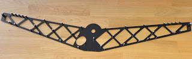{width="3.3333333333333335in"
height="1.0333333333333334in"}

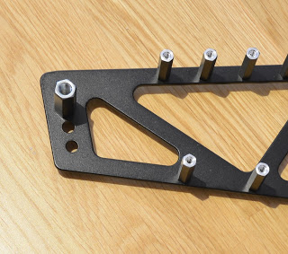{width="3.3333333333333335in"
height="2.933333333333333in"}

Step 2 - Drive shaft\
\
The drive unit consist of one ball bearing with a collar and two
aluminium pieces to hold the bearing\'s collar between them. Press the
bearing into the first piece as shown below, the left part.

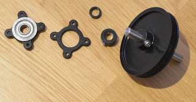{width="3.3333333333333335in"
height="1.7166666666666666in"}

This is then forced into the back side plane from the other side of the
cablecam, opposite the distance nuts.

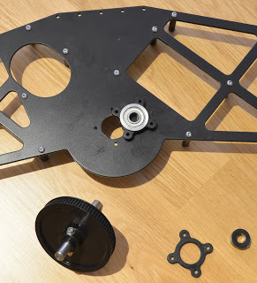{width="3.033333333333333in"
height="3.3333333333333335in"}

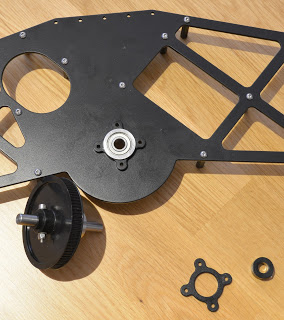{width="2.9583333333333335in"
height="3.3333333333333335in"}

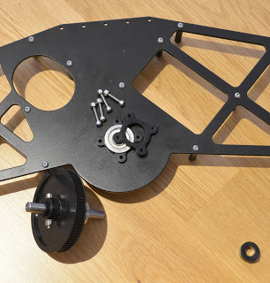{width="3.191666666666667in"
height="3.3333333333333335in"}

To hold the bearing in place, put the 4 M3x16 screws from the inside(!)
into the holes.

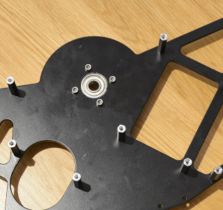{width="3.3333333333333335in"
height="3.1333333333333333in"}

Add the outer collar plate and tighten all with 4 washers and stop nuts.

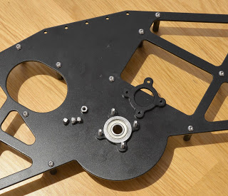{width="3.3333333333333335in"
height="2.8666666666666667in"}

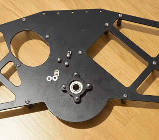{width="3.3333333333333335in"
height="2.925in"}

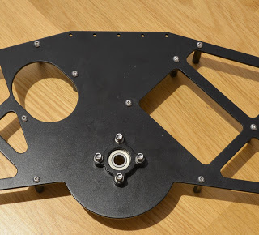{width="3.3333333333333335in"
height="3.0083333333333333in"}

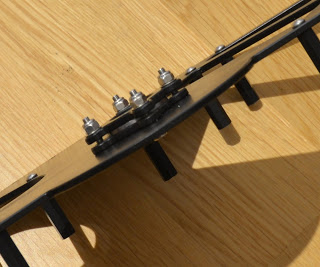{width="3.3333333333333335in"
height="2.775in"}

Put the d6x3mm washer onto the drive shaft and push it all into the ball
bearing.

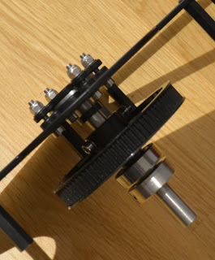{width="2.7583333333333333in"
height="3.3333333333333335in"}

Secure the drive shaft from the other side with the shaft lock.

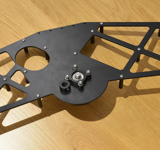{width="3.3333333333333335in"
height="3.1166666666666667in"}

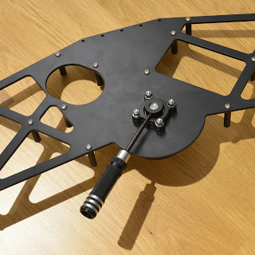{width="3.3333333333333335in"
height="3.3333333333333335in"}

Next step is to mount the motor and the pulley into the other side
plate.

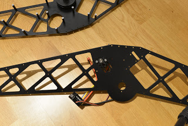{width="3.3333333333333335in"
height="2.216666666666667in"}

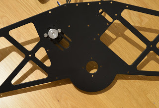{width="3.3333333333333335in"
height="2.275in"}

And before screwing both side plates together, add the timing belt.

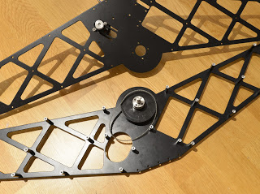{width="3.3333333333333335in"
height="2.4916666666666667in"}

Then push the plate through the drive drive dog into the second ball
bearing on the rive shaft.

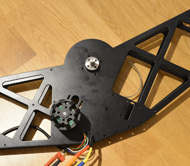{width="3.3333333333333335in"
height="2.8916666666666666in"}

This is how it all comes together. On the left side the collar bearing
is held in axial direction, on the right hand side the bearing is fixed
on the drive shaft but can move in axial direction if needed.

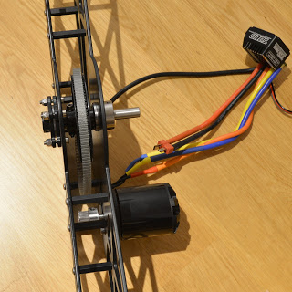{width="3.3333333333333335in"
height="3.3333333333333335in"}

Put the M3x16mm stud screws into the 5 distance nuts at the end of each
arm.

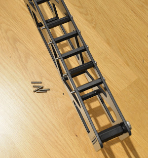{width="3.125in"
height="3.3333333333333335in"}

And mount the M3x30 distance nuts there.

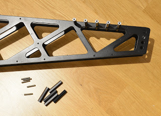{width="3.3333333333333335in"
height="2.3833333333333333in"}

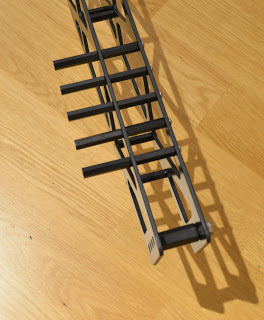{width="2.75in"
height="3.3333333333333335in"}

On the bottom side, next to the running wheels, add one M3x10 one each
side. The other right next to it will remain without a screw.

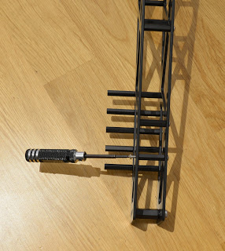{width="2.975in"
height="3.3333333333333335in"}

The gimbal mounting plate comes next. This block consists of 5 M3x45
screws and 5 d3x25 tubes plus the 2 8mm thick aluminium pieces. When
assembling, watchout the direction and what is upside. The large plate
goes under the motor. And the wholes in both pieces are not in the
middle but slightly off center. This should ensure the cablecam frame
does not get into the way.

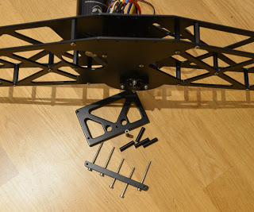{width="3.3333333333333335in"
height="2.783333333333333in"}

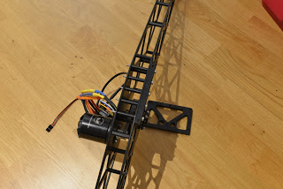{width="3.3333333333333335in"
height="2.216666666666667in"}

Here you can see the plates are above the cablecam frame side plates.

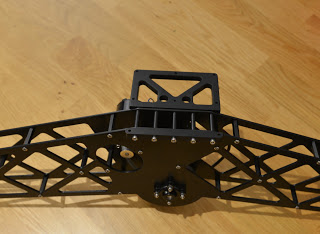{width="3.3333333333333335in"
height="2.425in"}

The battery holder is built using the two X pieces, 2 M3x10 and 2 M3x16
screws, 2 M3x45 screws on 2 distance nuts.

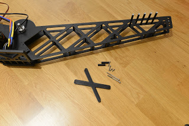{width="3.3333333333333335in"
height="2.216666666666667in"}

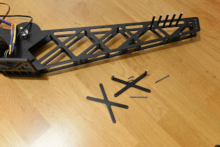{width="3.3333333333333335in"
height="2.216666666666667in"}

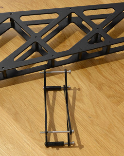{width="2.658333333333333in"
height="3.3333333333333335in"}

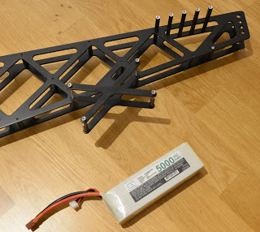{width="3.3333333333333335in"
height="2.975in"}

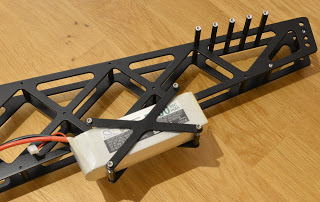{width="3.3333333333333335in"
height="2.1in"}

The running wheel has the ball bearings mounted and using 2 washers on
the inner side the wheel has the same distance from the frame as the
drive wheel will have, hence the rope will be in one line.

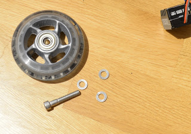{width="3.3333333333333335in"
height="2.3333333333333335in"}

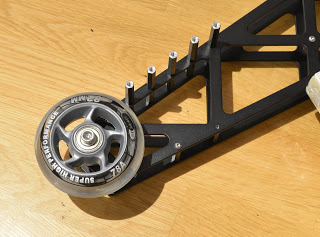{width="3.3333333333333335in"
height="2.4583333333333335in"}

The two cages are to be assembled next with 5 M3x10 screws and 1 M3x40
for each. The M3x40 only use is to make sure the cable cam can never
fall off the rope, even if it flips. So when putting it on the rope you
will first remove those two screws, set it on the rope and then add
those screws again as safety measure.

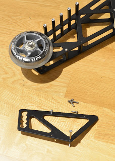{width="2.375in"
height="3.3333333333333335in"}

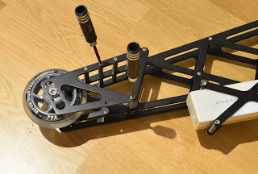{width="3.3333333333333335in"
height="2.2416666666666667in"}

Now it is time to add the remaining 21 M3x10 screws to give the frame
its stability. In case the battery holder was not used on one or even
both sides, add 2 of these screws in addition for each.

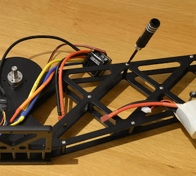{width="3.3333333333333335in"
height="3.0in"}

The drive wheel is added again with its 4 M3x25mm screws and 4 washers.

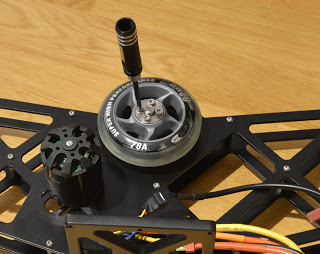{width="3.3333333333333335in"
height="2.65in"}

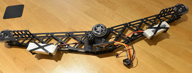{width="3.3333333333333335in"
height="1.2583333333333333in"}

Depending on what ESC you are using, you can mount the ESC onto the
frame directly. The SkyRC TS160 ESC requires 4 M2.5x10 screws and the
required holes have been added to the frame already.

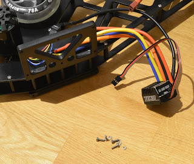{width="3.3333333333333335in"
height="2.8in"}

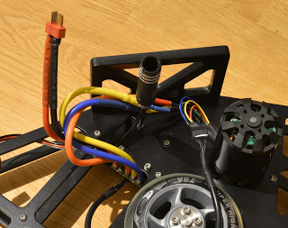{width="3.3333333333333335in"
height="2.6333333333333333in"}
