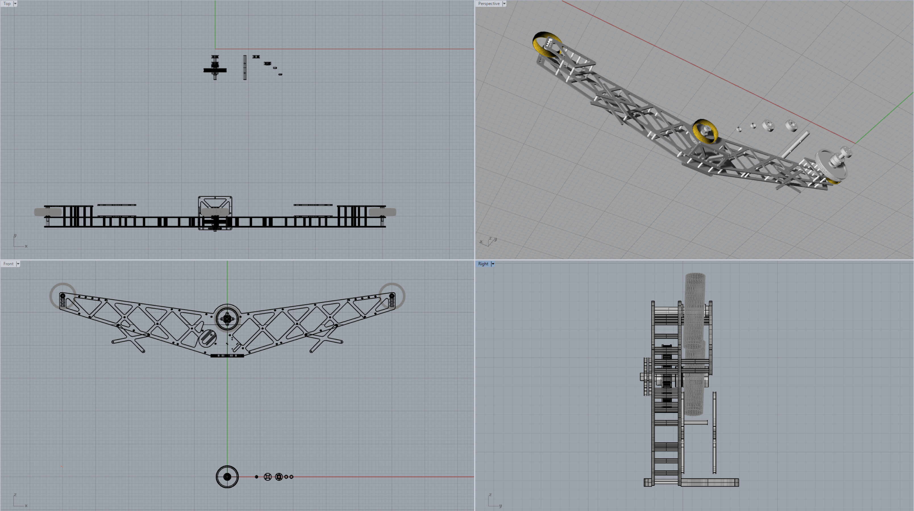
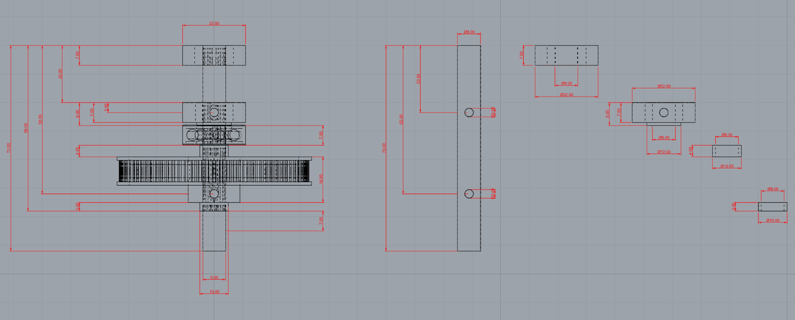
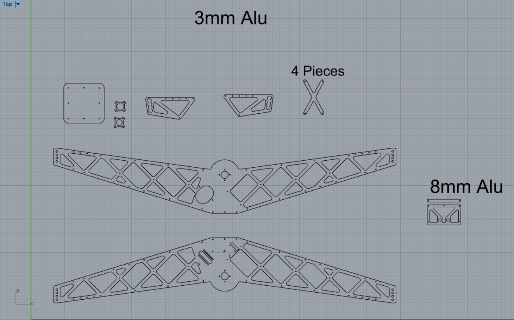

[LICENSE](LICENSE)

# CableCam Manufacturing

The CAD program primarily used is Rhino 3D V5.0 ([cablecam.3dm](https://github.com/wernerdaehn/cablecam/raw/master/cablecam.3dm)) but for better portability the exact same content is exported as AutoCAD ([cablecam.dxf](https://github.com/wernerdaehn/cablecam/raw/master/cablecam.dxf)) and Step file ([cablecam.stp](https://github.com/wernerdaehn/cablecam/raw/master/cablecam.stp)).

In case one of the files has a problem, file an Issue in this repository.

Generally speaking, the plans consists of three areas:

## 3D Model of the assembled CableCam using multiple layers
Here the entire CableCam can be seen.

## Drive Shaft assembly
On  the left hand side the drive shaft in assembled, on the right hand side copies of each object with each part being shown individually.

## Main body in 2D
The main body consists of 3mm thick aluminum mostly, except for the base plate where the Gimbal will be mounted on, that is 8mm thick.
These parts did undergo several iterations of design, e.g. initially some parts were 2.5D elements and had to be milled. To safe costs all has been redesigned to be pure 2D parts and waterjet cutting provide the best result. A clean surface with just a bit of chamfer needed afterwards - to make it perfect - and the cheapest way to manufacture all.

## Bill of Material

Item | Qty
-----|-----
spacer d3mm x 25mm | 11
shaft locking clip | 1
spacer d8mm 3mm | 1
spacer d8mm 4mm | 1
spacer M3 | 2
lock nut M3 | 9
socket head screw M3x10mm | 58
socket head screw M3x12mm | 12
stud screw M3x16mm | 10
distance nut M3x25mm | 39
socket head screw M3x30mm | 10
socket head screw M3x40mm | 4
socket head screw M3x45mm | 10
socket head screw M3x8mm | 4
distance nut M6x25mm | 2
socket head screw M6x35mm | 2
socket head screw M6x8mm | 2
spacer (short) for skate wheel | 2
washer for skate wheel | 4
ball bearing 608 | 5
flanged ball bearing 608 | 1
skatewheel 80mm | 3
distance nut M3x5mm | 2
timing belt T2.5 6mm 285mm | 1
belt pulley T2.5 6mm 84teeth | 1
motor pulley T2.5 6mm 16 teeth | 1
socket head screw M3x25mm | 1
socket head screw M3x50mm | 5
motor | 1
ESC | 1
motor sensorcable | 1

## Assembly

[Assembly.md](Assembly.md)
